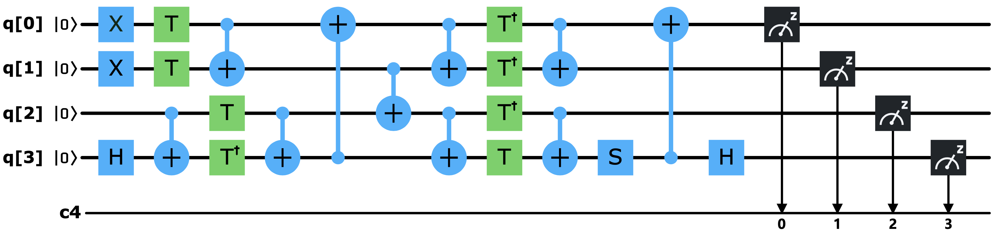
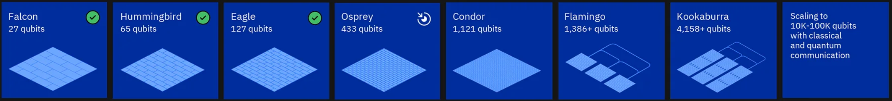
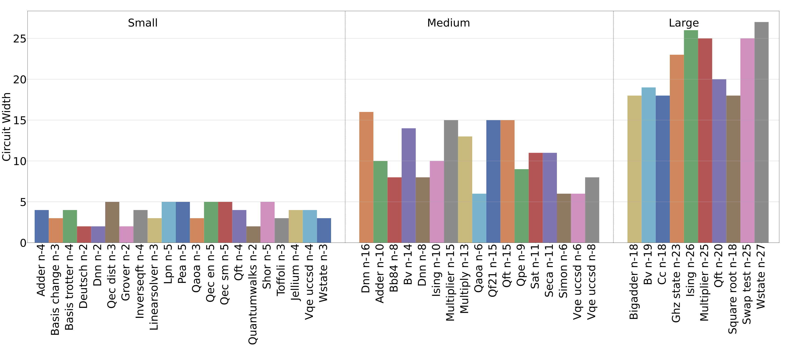
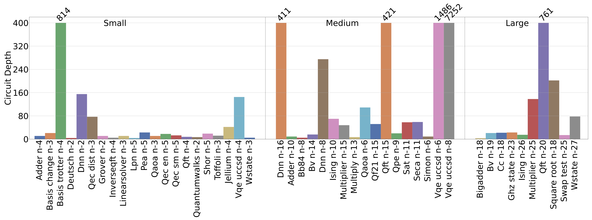
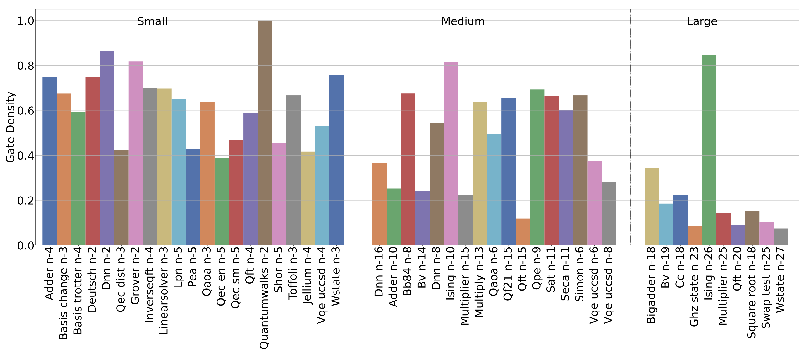
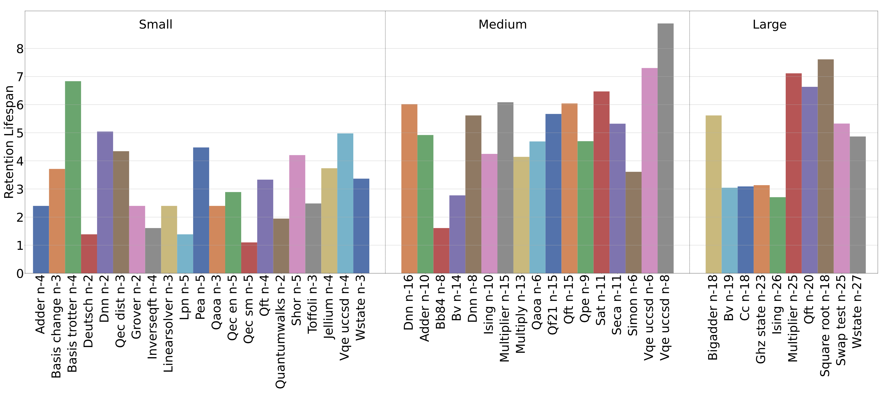
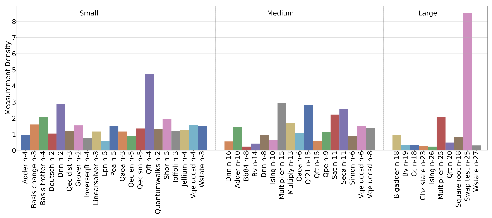
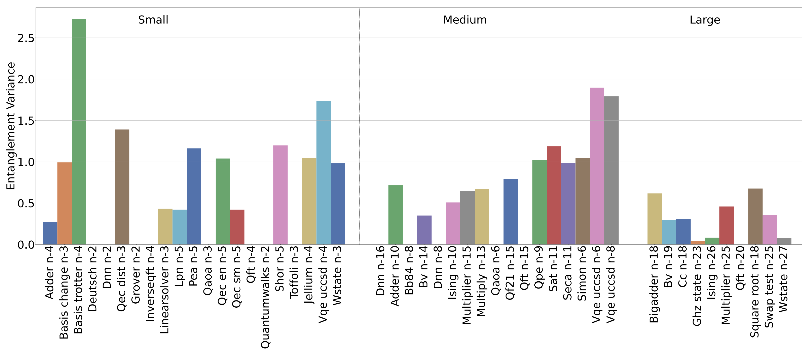

# QASMBench Benchmark Suite

QASMBench is an OpenQASM benchmark suite for NISQ evaluation. The .qasm code can be directly loaded in [IBM Quantum Experience](https://quantum-computing.ibm.com/) for execution. Please see our TQC paper ([DOI:10.1145/3550488](https://doi.org/10.1145/3550488) or on [arXiv](https://arxiv.org/abs/2005.13018)) for details.

If you need specialized circuits with the number of qubits being configurable, or circuits in alternative representations such as Cirq, QSharp, Qiskit, and PyQuil, please see our [NWQBench](https://github.com/pnnl/nwqbench).



## Current version

Latest version: **1.4**

## About QASMBench

The rapid development of quantum computing (QC) in the NISQ era urgently demands a light-weighted, low-level benchmark suite and insightful evaluation metrics for characterizing the properties of prototype NISQ devices, the efficiency of QC programming compilers, schedulers, and assemblers, and the capability of quantum simulators in a classical computer. QASMBench is a low-level, easy-to-use benchmark suite based on the [OpenQASM-2](https://github.com/Qiskit/openqasm) assembly representation. It consolidates commonly used quantum routines and kernels from a variety of domains including chemistry, simulation, linear algebra, searching, optimization, arithmetic, machine learning, fault tolerance, cryptography, etc., trading-off between generality and usability. Most of the QASMBench application code can be launched and verified in [IBM-Q](https://quantum-computing.ibm.com/) directly. For simulation purposes, you may also want to use our State-Vector simulator ([SV-Sim](https://github.com/pnnl/SV-Sim)) and Density-Matrix simulator ([DM-Sim](https://github.com/pnnl/DM-Sim)) to run on GPU/CPU HPC clusters.


To analyze these kernels in terms of NISQ device execution, in addition to circuit width and depth, we propose four circuit metrics including gate density, retention lifespan, measurement density, and entanglement variance, to extract more insights about the execution efficiency, the susceptibility to NISQ error, and the potential gain from machine-specific optimizations. We provide a script under the **metric** folder to analyze the OpenQASM circuit and report the metrics we defined. For each benchmark, the README.md lists the metrics which include what we defined in the paper and those defined in [SupermarQ](https://arxiv.org/abs/2202.11045).

## QASMBench Benchmarks
Depending on the number of qubits used, QASMBench includes three categories. For the introduction of the benchmarking routines under each category, please see our paper for detail. For each benchmark in the following tables, we list its name, brief description, and the algorithm category it belongs to, which is based on this Nature [paper](https://www.nature.com/articles/npjqi201523) by adding the categories of quantum arithmetic, quantum machine learning, and quantum communication. We try to update QASMBench with respect to [IBMQ roadmap](https://research.ibm.com/blog/ibm-quantum-roadmap-2025).





The 'Gates' here refers to the number of *Standard OpenQASM-2 gates* (see our [paper]((qasmbench.pdf))) but excluding those gates in a branching **if** statement. It is known that physical qubits in a NISQ device follow a certain topology. Since the 2-qubit gates such as **CNOT** (i.e., **CX**) can only be performed between two adjacent physical qubits, a series of SWAP operations can be required to move the relevant qubits until they become directly-connected. Therefore, we list the number of CNOT gates in the tables.


### Small-scale
Quantum circuits using **2 to 10** qubits.

| Benchmark | Description | Algorithm | Qubits | Gates | CNOT | Reference |
| :-------: |  ---------  | :-------: | :----: | :---: | :---:| :-------: |
| deutsch | Deutsch algorithm with 2 qubits for f(x) = x | Hidden Subgroup | 2 | 5 | 1 |[OpenQASM](https://arxiv.org/pdf/1707.03429.pdf)|
| iswap | An entangling swapping gate | Logical Operation | 2 | 9 | 2 | [OpenQASM](https://github.com/Qiskit/openqasm) |
| quantumwalks | Quantum walks on graphs with up to 4 nodes | Quantum Walk | 2 | 11 | 3 | [Repo](https://github.com/raffmiceli/Quantum_Walks) |
| grover | Grover’s algorithm | Search and Optimization | 2 | 16 | 2 | [AgentANAKIN](https://github.com/AgentANAKIN/Grover-s-Algorithm)|
| ipea | Iterative phase estimation algorithm | Hidden Subgroup | 2 | 68 | 30 | [OpenQASM](https://github.com/Qiskit/openqasm) |
| dnn | 3 layer quantum neural network sample | Machine Learning | 2 | 226 | 42 | [Ref](https://arxiv.org/abs/2012.00256) |
| teleportation | Quantum teleportation | Quantum Communication | 3 | 8 | 2 | [Ref](https://arxiv.org/abs/1607.02398)|
| qaoa | Quantum approximate optimization algorithm | Search and Optimization | 3 | 15 | 6 | [Repo](https://github.com/jtiosue/QAOAPython) |
| toffoli | Toffoli gate | Logical Operation | 3 | 18 | 6 | [Scaffold](https://github.com/epiqc/ScaffCC) |
| linearsolver | Solver for a linear equation of one qubit | Linear Equation | 3 | 19 | 4 |[Ref](https://journals.aps.org/pra/abstract/10.1103/PhysRevA.72.032301) |
| fredkin | Controlled-swap gate | Logical Operation | 3 | 19 | 8 | [Scaffold](https://github.com/epiqc/ScaffCC) |
| wstate    |  W-state preparation and assessment | Logical Operation |  3 |  30 | 9 |[OpenQASM](https://github.com/Qiskit/openqasm)|
| basis_change | Transform the single-particle basis of an linearly connected electronic structure | Quantum Simulation | 3 | 53 | 10 | [OpenFermion](https://github.com/quantumlib/OpenFermion-Cirq)|
| qrng | Quantum random number generator | Quantum Arithmetic | 4 | 4 | 0 | [Paper](https://arxiv.org/abs/1906.04410), [Repo](https://github.com/kentarotamura612/QRNG-benchmarking) |
| cat_state | Coherent superposition of two coherent states with opposite phase | Logical Operation | 4 | 4 | 3 | [Scaffold](https://github.com/epiqc/ScaffCC) |
| inverseqft | Performs an exact inversion of quantum Fourier transform | Hidden Subgroup | 4 | 8 | 0 | [OpenQASM](https://github.com/Qiskit/openqasm)|
| adder     | Quantum ripple-carry adder | Quantum Arithmetic | 4 | 23 | 10 | [Scaffold](https://github.com/epiqc/ScaffCC) |
| hs4 | Hidden subgroup problem | Hidden Subgroup | 4 | 28 | 4 | [Scaffold](https://github.com/epiqc/ScaffCC) |
| bell | Circuit equivalent to Bell inequality test | Logic Operation | 4 | 33 | 7 | [Cirq](https://github.com/quantumlib/cirq) |
| qft | Quantum Fourier transform | Hidden Subgroup | 4 | 36 | 12 | [OpenQASM](https://github.com/Qiskit/openqasm) |
| variational | Variational ansatz for a Jellium Hamiltonian with a linear-swap network | Quantum Simulation | 4 | 54 | 16 | [OpenFermion](https://github.com/quantumlib/OpenFermion-Cirq)|
| vqe | Variational quantum eigensolver | Linear Equation | 4 | 89 | 9 | [Scaffold](https://github.com/epiqc/ScaffCC) |
| vqe_uccsd | Variational quantum eigensolver with UCCSD | Linear Equation | 4 | 220 | 88 | [Scaffold](https://github.com/epiqc/ScaffCC) |
| basis_trotter | Implement Trotter steps for molecule LiH at equilibrium geometry | Quantum Simulation | 4 | 1626 | 582 | [OpenFermion](https://github.com/quantumlib/OpenFermion-Cirq)|
| qec_sm | Repetition code syndrome measurement | Error Correction | 5 | 5 | 4 | [OpenQASM](https://github.com/Qiskit/openqasm) |
| lpn | Learning parity with noise | Machine Learning | 5 | 11 | 2 | [sampaio96](https://github.com/sampaio96/Quantum-Computing)|
| qec_en | Quantum repetition code encoder | Error Correction | 5 | 25 | 10 | [sampaio96](https://github.com/sampaio96/Quantum-Computing)|
| shor | Shor’s algorithm | Hidden Subgroup | 5 | 64 | 30 | [Qiskit](https://github.com/Qiskit/qiskit) |
| pea | Phase estimation algorithm | Hidden Subgroup | 5 | 98 | 42 | [OpenQASM](https://github.com/Qiskit/openqasm) |
| error_correctiond3 | Error correction with distance 3 and 5 qubits | Error Correction | 5 | 114 | 49 |[Ref](https://www.sciencedirect.com/science/article/pii/S0010465517301935)|
| simons | Simon’s algorithm | Hidden Subgroup | 6 | 44 | 14 | [AgentANAKIN](https://github.com/AgentANAKIN/Simon-s-Algorithm) |
| qaoa | Quantum approximate optimization algorithm | Search and Optimization | 6 | 270 | 54 | [Cirq](https://github.com/quantumlib/cirq) |
| vqe_uccsd | Variational quantum eigensolver with UCCSD | Linear Equation | 6 | 2282 | 1052 | [Scaffold](https://github.com/epiqc/ScaffCC) |
| hhl  | Using HHL algorithm to solve linear system of equations  | Linear Equation  | 7 | 689 | 196 |[Qiskit HHL](https://qiskit.org/textbook/ch-applications/hhl_tutorial.html)|
| bb84 | A quantum key distribution circuit | Quantum Communication | 8 | 27 | 0 | [Cirq](https://github.com/quantumlib/cirq) |
| dnn | 16-dimension quantum neural network sample | Machine Learning | 8 | 1008 | 192 | [Ref](https://arxiv.org/abs/2012.00256) |
| vqe_uccsd | Variational quantum eigensolver with UCCSD | Linear Equation | 8 | 10808 | 5488 | [Scaffold](https://github.com/epiqc/ScaffCC) |
| qpe | Quantum phase estimation algorithm | Hidden Subgroup | 9 | 123 | 43 | [AgentANAKIN](https://github.com/AgentANAKIN/Quantum-Phase-Estimation) |
| adder | Quantum ripple-carry adder | Quantum Arithmetic | 10 | 142 | 65 | [OpenQASM](https://github.com/Qiskit/openqasm) |
| ising | Ising model simulation via QC | Quantum Simulation | 10 | 480 | 90 | [Scaffold](https://github.com/epiqc/ScaffCC) |
| hhl   | Using HHL algorithm to solve linear system of equations  | Linear Equation | 10 | 186795 | 72449 |[Qiskit HHL](https://qiskit.org/textbook/ch-applications/hhl_tutorial.html)|

### Medium-scale
Quantum circuits using **11 to 27** qubits.

| Benchmark | Description | Algorithm | Qubits | Gates | CNOT | Reference |
| :-------: |  ---------  | :-------: | :----: | :---: | :---:| :-------: |
| seca | Shor's error correction algorithm for teleportation | Error Correction | 11 | 216 | 84 | [AgentANAKIN](https://github.com/AgentANAKIN/Shors-Error-Correction-Algorithm) |
| sat | Boolean satisfiability problem | Search and Optimization | 11 | 679 | 252 | [OpenQASM](https://github.com/Qiskit/openqasm) |
| cc | Counterfeit coin finding problem | Search and Optimization | 12 | 22 | 11 | [OpenQASM](https://github.com/Qiskit/openqasm) |
| multiply | Performing 3×5 in a quantum circuit | Quantum Arithmetic | 13 | 98 | 40 | [AgentANAKIN](https://github.com/AgentANAKIN/Quantum-Multiplication) |
| gcm | Generator coordinate method | Quantum Chemistry | 13 | 3148 | 762 | [GCM](https://arxiv.org/abs/2212.09205) |
| bv | Bernstein-Vazirani algorithm | Hidden Subgroup | 14 | 41 | 13 | [OpenQASM](https://github.com/Qiskit/openqasm) |
| hhl  | Using HHL algorithm to solve linear system of equations  | Linear Equation  | 14 | 3726506 | 1042859 |[HHL](https://github.com/anedumla/quantum_linear_solvers)|
| qf21 | Using quantum phase estimation to factor the number 21 | Hidden Subgroup | 15 | 311 | 115 | [AgentANAKIN](https://github.com/AgentANAKIN/Quantum-Factoring-21) |
| multiplier | Quantum multiplier | Quantum Arithmetic | 15 | 574 | 246 | [Cirq](https://github.com/quantumlib/cirq) |
| factor247 | Factorizing 247 to 13x19 with preiod=12 | Hidden Subgroup | 15 | 610573 | 273071 | Reproduced from [Ref](https://www.it4i.cz/en) with modification |
| dnn | quantum neural network sample | Machine Learning | 16 | 2016 | 384 | [Ref](https://arxiv.org/abs/2012.00256) |
| qec9xz | Quantum error correction 9-qubit code | Error Correction | 17 | 53 | 32 | [Ref](https://arxiv.org/pdf/0905.2794.pdf) |
| qft | Quantum Fourier transform | Hidden Subgroup | 18 | 783 | 306 | [OpenQASM](https://github.com/Qiskit/openqasm) |
| bigadder | Quantum ripple-carry adder | Quantum Arithmetic | 18 | 284 | 130 | [OpenQASM](https://github.com/Qiskit/openqasm) |
| square_root | Computing the square root of an number via amplitude amplification | Quantum Arithmetic | 18 | 2300 | 898 | [Scaffold](https://github.com/epiqc/ScaffCC) |
| bv | Bernstein-Vazirani algorithm | Hidden Subgroup | 19 | 56 | 18 | [OpenQASM](https://github.com/Qiskit/openqasm) |
| qram | Bucket brigade qRAM prototype circuit | Quantum Architecture | 20 | 223 | 92 | [Ref](https://iopscience.iop.org/article/10.1088/1367-2630/17/12/123010/pdf) |
| bwt | Binary Welded Tree: a quantum walk algorithm in continuous time domain | Quantum Walk | 21 | 462001 | 174800 | QASMBench |
| cat_state | Coherent superposition of two coherent states with opposite phase | Logical Operation | 22 | 22 | 21 | QASMBench |
| ghz_state | Greenberger-Horne-Zeilinger (GHZ) state for max entanglement | Logical Operation | 23 | 23 | 22 | QASMBench |
| vqe | Variational quantum eigensolver | Quantum Simulation | 24 | 2306072 | 1538240 | QASMBench |
| swap_test | Swap test to measure quantum state distance | Machine Learning | 25 | 230 | 96 | QASMBench |
| knn | Quantum K-nearest neighbor | Search and Optimization | 25 | 230 | 96 | [Ref](https://arxiv.org/pdf/2003.09187.pdf) |
| ising | Ising model simulation via QC | Quantum Simulation | 26 | 280 | 50 | QASMBench |
| wstate |  W-state preparation and assessment | Logical Operation | 27 | 157 | 52 | QASMBench |

### Large-scale
Quantum circuits using **28 to 433** qubits or more.

| Benchmark | Description | Algorithm | Qubits | Gates | CNOT | Reference |
| :-------: |  ---------  | :-------: | :----: | :---: | :---:| :-------: |
| vqe_uccsd | Variational quantum eigensolver with UCCSD | Linear Equation | 28 | 399482 | 296648 | QASMBench |
| adder | Quantum adder | Quantum Arithmetic | 28, 64, 118, 433 | 424, 988, 1834, 6769 | 195, 455, 845, 3120 | QASMBench |
| bv | Bernstein-Vazirani algorithm | Hidden Subgroup | 30, 70, 140, 280 | 78, 176, 352, 712 | 18, 36, 72, 152 | QASMBench |
| bwt | Binary Welded Tree: a quantum walk algorithm in continuous time domain | Quantum Walk | 37, 57, 97, 177 | 1649201, 3145201, 6113201, 12049201 | 632400, 1209200, 2353200, 4641200 | QASMBench |
| cat | Coherent superposition of two coherent states with opposite phase | Logical Operation | 35, 65, 130, 260 | 35, 65, 130, 260 | 34, 64, 129, 259 | QASMBench |
| cc | Counterfeit coin finding problem | Search and Optimization | 32, 64, 151, 301 | 62, 126, 300, 600 | 31, 63, 150, 300 | QASMBench |
| dnn | quantum neural network sample | Machine Learning | 33, 51 | 608, 959  | 248, 392  | [Ref](https://arxiv.org/abs/2012.00256) |
| ghz | Greenberger-Horne-Zeilinger (GHZ) state for max entanglement | Logical Operation | 40, 78, 127, 255 | 40, 78, 127, 255 | 39, 77, 126, 254  | QASMBench |
| ising | Ising model simulation via QC | Quantum Simulation | 34, 66, 98, 420 | 368, 720, 1072, 4614 | 66, 130, 194, 838  | QASMBench |
| knn | Quantum K-nearest neighbor | Search and Optimization | 31, 67, 129, 341 | 287, 629, 1218, 3232 | 120, 264, 512, 1260 | [Ref](https://arxiv.org/pdf/2003.09187.pdf) |
| multiplier | Quantum multiplier | Quantum Arithmetic | 45, 75, 350, 400 | 5981, 17077, 383844, 501877 | 2574, 7350, 165200, 216000  |  QASMBench |
| qft | Quantum Fourier transform | Hidden Subgroupe | 29, 63, 160, 320 | 2059, 9828, 63760, 255520 | 812, 3906, 25440, 102080 |  QASMBench |
| qugan | Quantum generative adversarial network | Machine Learning | 39, 71, 111, 395 | 759, 1415, 2235, 8057 | 296, 552, 872, 3144 | [Ref](https://arxiv.org/abs/2010.09036) |
| square_root | Computing the square root of an number via amplitude amplification | Quantum Arithmetic | 45, 60  | 138794, 1061939  | 54151, 415123 |  QASMBench |
| swap_test | Swap test to measure quantum state distance | Machine Learning | 41, 83, 115, 361 | 382, 781, 1085, 3422 | 160, 328, 456, 1440 | QASMBench |
| wstate |  W-state preparation and assessment | Logical Operation | 36, 76, 118, 380 | 211, 451, 703, 2275 | 70, 150, 234, 758 | QASMBench |
| quantum telecloning | Prepare quantum telecloning state | Quantum Cloning | 201, 2001 | | | [Ref1](https://arxiv.org/abs/2308.15579), [Ref2](https://arxiv.org/abs/2210.10164), [Ref3](https://arxiv.org/abs/2205.00125) |
| QAOA on MAX-3-SAT | QAOA with random angles on random 3-SAT problems | QAOA | 100, 1000, 10000 | | | [Ref](https://arxiv.org/abs/2306.03238) |
| quantum volume | Random Quantum Volume Benchmark Circuits | Quantum Volume | 32, 100, 1000 | | | [Ref1](https://arxiv.org/abs/1811.12926), [Ref2](https://arxiv.org/abs/2110.14808), [Ref3](https://arxiv.org/abs/2203.03816) |

### qelib1.inc
OpenQASM header file that defines all the gates. Please see [OpenQASM](https://github.com/Qiskit/openqasm) and our [paper](qasmbench.pdf) for details.


## QASMBenchmark Suite Structure
Each benchmark folder includes the following file:
- bench.qasm: OpenQASM source file.
- bench.png: Visualization of the circuit from IBM QE.
- res_bench.png: Running results from IBM QE quantum backends (mainly 5-qubit Burlington, 15-qubit Melbourne, and 27-qubit Paris).

## Tests

The QASMBench circuits can be directly uploaded and verified on [IBM-Q](https://quantum-computing.ibm.com/) NISQ quantum device.

## Classic HPC simulation

You may also want to use our state-vector and density-matrix quantum circuit simulator ([SV-Sim](https://github.com/pnnl/SV-Sim) and [DM-Sim](https://github.com/pnnl/DM-Sim)) for simulating the QASMBench benchmark circuits efficiently on modern CPU (Intel X86, AMD X86, IBM Power), GPU (NVIDIA GPU and AMD GPU) and Xeon-Phi workstations or HPC clusters (e.g., ORNL Summit/Frontier, ANL Theta, and NERSC Cori/Perlmutter Supercomputers).


## Metrics
We propose a set of circuit-based evaluation metrics representing various features of a quantum application. These metrics are designed such that through them certain estimations can be performed on executing a particular circuit over a particular NISQ device. The metrics serve as useful indicators of how a quantum circuit can stress a NISQ hardware device. Please see our [paper](qasmbench.pdf) for the math formula and analysis.

### Circuit Width

Circuit width is defined as the number of qubits that enter the superposition state at least once within an application’s lifespan. Qubits that are measured in the interim of a circuit and re-enter superposition are only counted as one qubit towards the circuit width. Circuit width dictates the spatial capacity required for a quantum device in order to run the quantum circuit. The following figure shows the circuit width of QASMBench:



### Circuit Depth

Circuit depth is defined as the minimum time-evolution steps required to complete a quantum application. Time evolution is the process of completing all gates defined at time T=T(j), and once these are completed, the circuit moves onto time T = T(j+1), where the following gates are to be processed. Circuit depth can be computed by decomposing OpenQASM code into a n(q) x T matrix Q, where Q(q(i),t(j)) is the time-evolution steps to complete the gate on qubit i at time j. The sum of the maximum time in each column is then equal to the minimum time required for a quantum application. The following figure shows the circuit depth of QASMBench:


### Gate Density

Gate density, or operation density, describes the occupancy of gate slots along the time-evolution steps of a quantum circuit. As certain qubits might need to wait for other qubits in the time evolution (i.e, gate dependency), they remain idle by executing the identity gate (ID gate). Consequently, if a gate slot is empty due to dependency, it implies a lower occupancy for the quantum hardware. This is similar to a classical processor, where data dependency introduces pipeline bubbles and reduced occupancy. We propose Gate Density to measure the likely occupancy of a circuit when mapping to quantum hardware. The following figure shows the gate density of QASMBench:



### Retention Lifespan

Retention Lifespan describes the maximum lifespan of a qubit within a system and is motivated by the T1 and T2 coherence time of a quantum device. A longer lifespan of a quantum system implies more decay to the ground state (T1) and state-transition due to environment noise (T2), thus is more susceptible to information loss. Therefore, we propose taking the qubit with the longest lifespan to determine the system’s retention lifespan. Using this metric, one can estimate if a particular circuit can be executed in a NISQ device with high fidelity, given its T1/T2 coherence time. Note, all IBM-Q machines offer T1/T2 coherence time as status indicators for the hardware. As circuit depth can grow substantially, we introduce the log operator to shrink the scale. The following figure shows the retention lifespan of QASMBench:


### Measurement Density

Measurement density assesses the importance of measurements in a circuit. A higher measurement count implies the fact that each measurement might be of relatively less importance (e.g., periodic measurement in QEC, or measurement over ancilla qubits), whereas for applications with fewer measurements, the measurement may be of utmost importance. The importance also increases when a measurement accounts for a wider and/or deeper circuit. A good example is the SWAP test, where the circuit can be very large but only one measurement is taken to report the similarity. Consequently, this measurement is extremely important to the application. Since the circuit depth/width can be large and the importance of measurement decays when the circuit depth/width keeps on increasing, we add a log to shrink the scale. The following figure shows the retention lifespan of QASMBench:



### Entanglement Variance

Entanglement Variance measures the balance of entanglement across the qubits of a circuit. Circuits with a higher Entanglement Variance indicate that certain qubits are more connected than other qubits (i.e., using more 2-qubit gates such as CX than others). This metric implies that when the circuit is mapped to a NISQ device: (i) fewer SWAP gates are needed if those hotspot qubits are mapped to the central vertices in the NISQ device topology, such as Qubit-1 in ibmq-belem and Qubit-2 in ibmq-yorkton). A higher entanglement variance implies a higher potential benefit from a good logic-physical qubit-mapping through quantum transpilation. If the entanglement variance is zero, the little benefit should be expected from a better transpilation strategy; (ii) Given 2-qubit gate is one of the major sources introducing error, a higher Entanglement Variance implies uneven error introduction among qubits. The following figure shows the entanglement variance of QASMBench:



### OpenQASM

OpenQASM (Open Quantum Assembly Language) is a low-level quantum intermediate representation (IR) for quantum instructions, similar to the traditional *Hardware-Description-Language* (HDL) like Verilog and VHDL. OpenQASM is the open-source unified low-level assembly language for IBM quantum machines publically available on the cloud that have been investigated and verified by many existing research works. Several popular quantum software frameworks use OpenQASM as one of their output-formats, including [Qiskit](https://github.com/Qiskit/qiskit), [Cirq](https://github.com/quantumlib/cirq), [Scaffold](https://github.com/epiqc/ScaffCC), [ProjectQ](https://github.com/ProjectQ-Framework/ProjectQ), etc.

#### Qiskit
The *Quantum Information Software Kit* ([Qiskit](https://github.com/Qiskit/qiskit)) is a quantum software developed by *IBM*. It is based on Python. OpenQASM can be generated from Qiskit via:
```text
QuantumCircuit.qasm()
```

#### Cirq
[Cirq](https://github.com/quantumlib/cirq) is a quantum software framework from *Google*. OpenQASM can be generated from Cirq (not fully compatible) via:
```text
cirq.Circuit.to_qasm()
```

#### Scaffold
[Scaffold](https://github.com/epiqc/ScaffCC) is a quantum programming language embedded in the C/C++ programming language based on the [LLVM](https://github.com/llvm/llvm-project) compiler toolchain. A Scaffold program can be compiled by [Scaffcc](https://arxiv.org/pdf/1507.01902.pdf) to OpenQASM via "**-b**" compiler option.

#### ProjectQ
[ProjectQ](https://github.com/ProjectQ-Framework/ProjectQ) is a quantum software platform developed by *Steiger et al.* from ETH Zurich. The official website is [here](https://projectq.ch/). ProjectQ can generate OpenQASM when using IBM quantum machines as the backends:
```text
IBMBackend.get_qasm()
```


## Authors

[Ang Li](http://www.angliphd.com/), Pacific Northwest National Laboratory (PNNL)

[Samuel Stein](https://www.pnnl.gov/science/staff/staff_info.asp?staff_num=10490), Pacific Northwest National Laboratory (PNNL)

[Sriram Krishnamoorthy](https://hpc.pnl.gov/people/sriram/), Pacific Northwest National Laboratory (PNNL)

[James Ang](https://www.pnnl.gov/people/james-ang), Pacific Northwest National Laboratory (PNNL)

And also the original authors that developed these quantum routines.


## Citation format

For research articles, please cite our paper:

- Ang Li, Samuel Stein, Sriram Krishnamoorthy, and James Ang. "QASMBench: A Low-Level Quantum Benchmark Suite for NISQ Evaluation and Simulation." ACM Transactions on Quantum Computing (2022). [DOI:10.1145/3550488](https://doi.org/10.1145/3550488), [[arXiv:2005.13018]](https://arxiv.org/abs/2005.13018).


Bibtex:
```text
@article{li2022qasmbench,
  title={QASMBench: A Low-Level Quantum Benchmark Suite for NISQ Evaluation and Simulation},
  author={Li, Ang and Stein, Samuel and Krishnamoorthy, Sriram, and Ang, James},
  journal={ACM Transactions on Quantum Computing},
  year={2022},
  publisher={ACM New York, NY}
}

```


## License

This project is licensed under the BSD License, see [LICENSE](LICENSE) file for details.

## Acknowledgments

We acknowledge the support from the many developers and the open-source community.

PNNL-IPID: 31924-E, IR: PNNL-SA-153380, PNNL-SA-162867, ECCN:EAR99

This work was supported by the DOE Office of Science National Quantum Information Science Research Centers, Co-design Center for Quantum Advantage ([C2QA](https://www.bnl.gov/quantumcenter/)) under contract number DE-SC0012704.
This research used resources from the Oak Ridge Leadership Computing Facility, which is a DOE Office of Science User Facility supported under
Contract DE-AC05-00OR22725. This research used resources of the National Energy Research Scientific Computing Center (NERSC), a U.S. Department of Energy Office of Science User Facility located at Lawrence Berkeley National Laboratory, operated under Contract No. DE-AC02-05CH11231 using NERSC award ERCAP0022228.

We also acknowledge support from Microsoft’s Azure Quantum for providing credits and access to the ion-trap quantum hardware used in our evaluation.
The Pacific Northwest National Laboratory is operated by Battelle for the U.S. Department of Energy under contract DE-AC05-76RL01830.


## Contributing

Please contact us If you'd like to add your circuits to the benchmark suite or if you'd like to remove your circuits from the suite.
